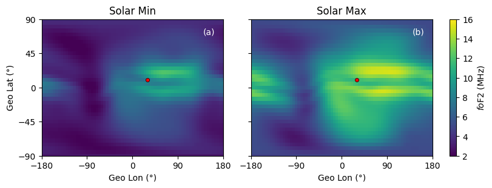
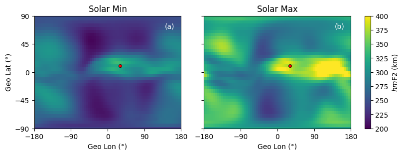
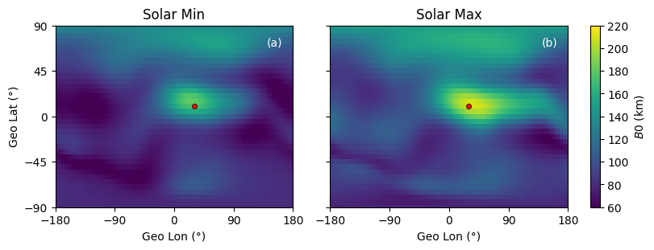
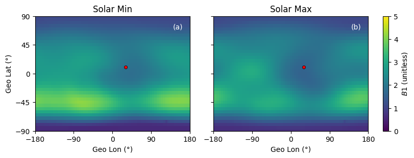
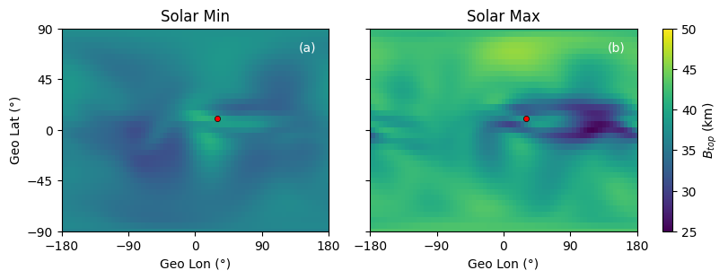
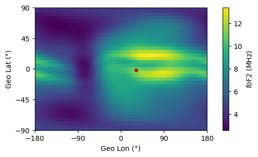
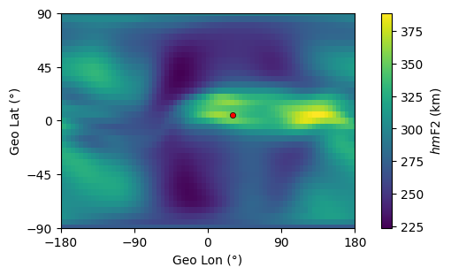
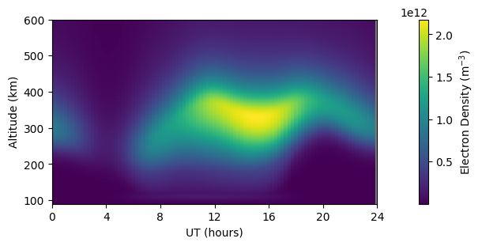
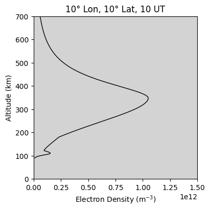
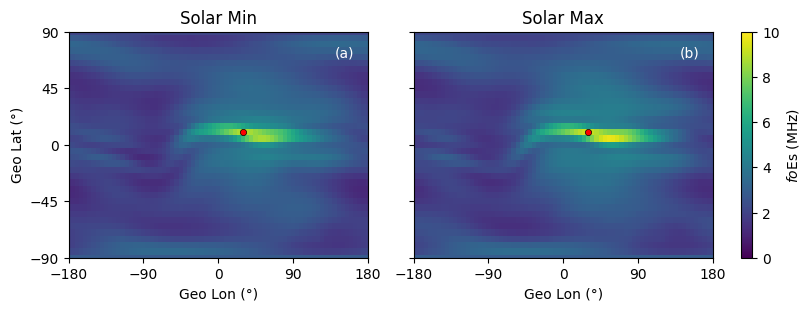

# PyIRI
[](https://pypi.org/project/PyIRI/)
[](https://github.com/victoriyaforsythe/PyIRI/actions/workflows/main.yml)
[](https://pyiri.readthedocs.io/en/latest/?badge=latest)
[](https://doi.org/10.5281/zenodo.8235173)
[](https://coveralls.io/github/victoriyaforsythe/PyIRI?branch=main)

**PyIRI** is a modern Python implementation of the International Reference Ionosphere (IRI) model.  
It provides fast, global, and altitude‑dependent evaluation of ionospheric parameters using a new **spherical harmonics (SH) architecture**.  
The model supports multiple coordinate systems and can efficiently evaluate all grid points and time frames simultaneously.

---

## Highlights

- **Spherical harmonics framework** for: **foF2**, **hmF2**, **B0**, **B1** and **foEs**
- Supports **GEO**, **QD**, and **MLT** coordinate systems  
- Compatible with both the new **SH‑based** and legacy **URSI/CCIR** coefficient models
- Modular and fully in Python — no external dependencies or Fortran libraries

---

## Installation

Install from PyPI:

```bash
pip install PyIRI
```

Or clone and install from the GitHub repository:

```bash
git clone https://github.com/victoriyaforsythe/PyIRI.git
cd PyIRI
pip install .
```

For more details and usage examples, see the Jupyter [tutorials](https://github.com/victoriyaforsythe/PyIRI/tree/main/docs/tutorials).

---

## Example: Monthly Mean Ionospheric Parameters

PyIRI can compute monthly mean ionospheric parameters for a user‑defined grid.
The evaluation occurs simultaneously across all grid points and for all desired Universal Time (UT) frames.

```python
import numpy as np
import PyIRI
import PyIRI.edp_update as ml
import PyIRI.sh_library as sh

year = 2020
month = 4
```

Create any horizontal grid (regular or irregular, global or regional).
Grid arrays must be flattened to 1‑D NumPy arrays:

```python
dlon = 5
dlat = 5
alon_2d, alat_2d = np.mgrid[-180:180 + dlon:dlon, -90:90 + dlat:dlat]
alon = alon_2d.ravel()
alat = alat_2d.ravel()
```

Create a time array in decimal hours:

```python
hr_res = 1
aUT = np.arange(0, 24, hr_res)
```

Compute F2, F1, and E‑region parameters using the **new spherical harmonics coefficients**:

```python
hmF2_model = 'SHU2015'   # Also available: 'AMTB2013', 'BSE1979'
foF2_coeff = 'URSI'      # Also available: 'CCIR'
coord = 'GEO'            # Also available: 'QD', 'MLT'

f2, f1, e_peak, sun, mag = sh.IRI_monthly_mean_par(
    year, month, aUT, alon, alat,
    coeff_dir=None,
    foF2_coeff=foF2_coeff,
    hmF2_model=hmF2_model,
    coord=coord)
```

<div align="center">
  
  
  
  
  
</div>

Alternatively, the original URSI or CCIR climatological coefficients can be used:

```python
ccir_or_ursi = 0  # 0 = CCIR, 1 = URSI
f2, f1, e_peak, es_peak, sun, mag = ml.IRI_monthly_mean_par(
    year, month, aUT, alon, alat,
    PyIRI.coeff_dir, ccir_or_ursi)
```

---

## Example: Daily Ionospheric Parameters (F10.7 Driven)

PyIRI can also compute daily ionospheric parameters, interpolated in time and solar activity.
The user provides the F10.7 index for the day of interest.

Define F10.7 index in solar flux units:

```python
F107 = 100
```

Create altitude array in km:

```python
aalt = np.arange(90, 1000, 1)
```

Define day of interest:

```python
day = 1
```

Run PyIRI (with spherical harmonic coefficients):

```python
F2, F1, E, sun, mag, EDP = sh.IRI_density_1day(
    year, month, day, aUT, alon, alat, aalt, F107,
    coeff_dir=None,
    foF2_coeff=foF2_coeff,
    hmF2_model=hmF2_model,
    coord=coord)
```

<div align="center">
  
  
</div>


Or, use the original CCIR/URSI version for compatibility:

```python
f2, f1, e_peak, es_peak, sun, mag, edp = ml.IRI_density_1day(
    year, month, day, aUT, alon, alat, aalt, F107,
    PyIRI.coeff_dir, ccir_or_ursi)
```

---

## Total Electron Content (TEC)

PyIRI does not calculate the Total Electron Content (TEC) automatically because altitude spacing affects accuracy.
The TEC can be derived from the electron density profile (EDP) using:

```python
TEC = PyIRI.main_library.edp_to_vtec(edp, aalt, min_alt=0.0, max_alt=202000.0)
```

<div align="center">
  
</div>

---

## Example: Single‑Location Diurnal Variation

To evaluate parameters at a single location, provide locations:

```python
alon = 10.
alat = 20.
```

Run PyIRI (with spherical harmonic coefficients):

```python
F2, F1, E, sun, mag, EDP = sh.IRI_density_1day(
    year, month, day, aUT, alon, alat, aalt, F107,
    coeff_dir=None,
    foF2_coeff=foF2_coeff,
    hmF2_model=hmF2_model,
    coord=coord)
```

<div align="center">
  
  
</div>

---

## Example: Sporadic E

Sporadic E fields require more spherical harmonic coefficients and threfore were de-coupled from the main call:

Run PyIRI Es (with spherical harmonic coefficients):

```python
Es = sh.sporadic_E_monthly_mean(year,
                                month,
                                aUT,
                                alon,
                                alat,
                                coeff_dir=None,
                                coord='GEO')
```

<div align="center">
  
</div>

---

## Tutorials

Comprehensive Jupyter notebooks are available in [`docs/tutorials`](https://github.com/victoriyaforsythe/PyIRI/tree/main/docs/tutorials):

- `Mean_monthly_parameters.ipynb`
- `Daily_parameters.ipynb`
- `Single_location.ipynb`
- `Coordinate_Transformation.ipynb`
- `PyIRI_year_run.ipynb`
- `Generate_Apex_Coefficients.ipynb`

---

## Citation

If you use PyIRI in your work, please cite:

> Forsythe, V. (2025). *PyIRI: Python implementation of the IRI model using spherical harmonics.* Zenodo.
> [https://doi.org/10.5281/zenodo.8235173](https://doi.org/10.5281/zenodo.8235173)

> Servan-Schreiber, N., Forsythe, V., et al. (2025). *A Major Update to the PyIRI model.* Space Weather, submitted.