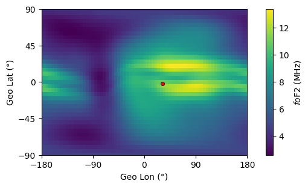
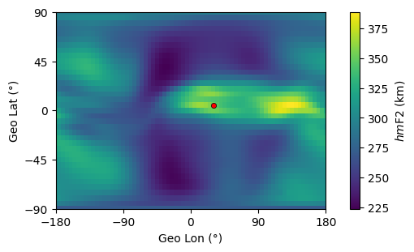
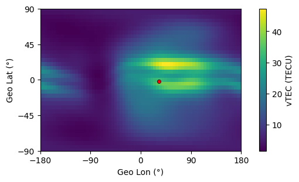
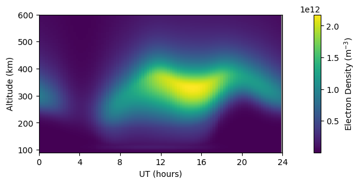
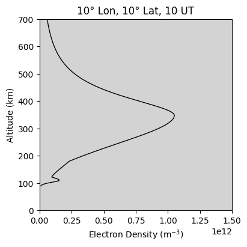

# PyIRI
[](https://pypi.org/project/PyIRI/)
[](https://github.com/victoriyaforsythe/PyIRI/actions/workflows/main.yml)
[](https://pyiri.readthedocs.io/en/latest/?badge=latest)
[](https://doi.org/10.5281/zenodo.8235172)
[](https://coveralls.io/github/victoriyaforsythe/PyIRI?branch=main)

**PyIRI** is a modern Python implementation of the International Reference Ionosphere (IRI) model.  
It provides fast, global, and altitude‑dependent evaluation of ionospheric parameters using a new **spherical harmonics (SH) architecture**.  
The model supports multiple coordinate systems and efficiently evaluates all grid points and time frames simultaneously.
---

## Highlights

- **Spherical harmonics framework** for: **foF2**, **hmF2**, **B0**, **B1** and **foEs**
- Supports **GEO**, **QD**, and **MLT** coordinate systems  
- Compatible with both the new **SH‑based** and legacy **URSI/CCIR** coefficient models
- Modular and fully in Python — no external dependencies or Fortran libraries

---

## Installation

Install from PyPI:

```bash
pip install PyIRI
```

Or clone and install from the GitHub repository:

```bash
git clone https://github.com/victoriyaforsythe/PyIRI.git
cd PyIRI
pip install .
```

For more details and usage examples, see the Jupyter [tutorials](https://github.com/victoriyaforsythe/PyIRI/tree/main/docs/tutorials).

---

## Example: Daily Ionospheric Parameters (F10.7 Driven)

PyIRI computes daily ionospheric parameters, interpolated in both time and solar activity.
The user provides the F10.7 index for the day of interest.

Define the F10.7 index in solar flux units (sfu):

```python
F107 = 100
```

Create altitude array in km:

```python
aalt = np.arange(90, 1000, 1)
```

Define day of interest:

```python
day = 1
```

Run PyIRI (with spherical harmonic coefficients):

```python
F2, F1, E, Es, sun, mag, EDP = sh.IRI_density_1day(
    year, month, day, aUT, alon, alat, aalt, F107,
    coeff_dir=None,
    foF2_coeff=foF2_coeff,
    hmF2_model=hmF2_model,
    coord=coord)
```

<div align="center">
  
  
</div>


Or, use the original CCIR/URSI version for compatibility:

```python
f2, f1, e_peak, es_peak, sun, mag, edp = ml.IRI_density_1day(
    year, month, day, aUT, alon, alat, aalt, F107,
    PyIRI.coeff_dir, ccir_or_ursi)
```

---

## Total Electron Content (TEC)

PyIRI does not calculate the Total Electron Content (TEC) automatically because altitude spacing affects accuracy.
The TEC can be derived from the electron density profile (EDP) using:

```python
TEC = PyIRI.main_library.edp_to_vtec(edp, aalt, min_alt=0.0, max_alt=202000.0)
```

<div align="center">
  
</div>

---

## Example: Single‑Location Diurnal Variation

To evaluate parameters at a single location, provide scalar longitude and latitude values:

```python
alon = 10.
alat = 20.
```

Run PyIRI (with spherical harmonic coefficients):

```python
F2, F1, E, Es, sun, mag, EDP = sh.IRI_density_1day(
    year, month, day, aUT, alon, alat, aalt, F107,
    coeff_dir=None,
    foF2_coeff=foF2_coeff,
    hmF2_model=hmF2_model,
    coord=coord)
```

<div align="center">
  
  
</div>

---

## Tutorials

Comprehensive Jupyter notebooks are available in [`docs/tutorials`](https://github.com/victoriyaforsythe/PyIRI/tree/main/docs/tutorials):

- `Daily_parameters.ipynb`
- `Single_location.ipynb`
- `Coordinate_Transformation.ipynb`
- `PyIRI_year_run.ipynb`
- `Generate_Apex_Coefficients.ipynb`
- `Generate_SH_coefficients.ipynb`

---

## Routine Package Maintenance: IGRF Updates

The PyIRI model relies on an accurate representation of the Earth's magnetic field for the spherical harmonics library. PyIRI uses the quasi-dipole (QD) magnetic coordinate system.  These coordinates, which ultimately derive from the International Geomagnetic Reference Field (IGRF) coefficients, are computed by apexpy and then fit via Spherical Harmonics (SH) for easy reference. When a new IGRF definition is released, the previous set of IGRF coefficient files (especially the last five years, which are an extrapolation) become obsolete.
To maintain PyIRI when a new IGRF definition comes out, maintainers must first ensure that apexpy has been updated to incorporate the latest IGRF coefficients. Once apexpy is current, it must be rerun to generate a new apex.nc coefficient file via SH fits. This process synchronizes PyIRI's magnetic coordinate grids with the updated IGRF and ensures the model remains accurate in MLT–QDLat space for the new epoch.

---

## Citation

If you use PyIRI in your research, please cite:

> Forsythe, V. (2025). *PyIRI: Python implementation of the IRI model using spherical harmonics.* Zenodo.
> [https://doi.org/10.5281/zenodo.8235173](https://doi.org/10.5281/zenodo.8235173)

> Servan-Schreiber, N., Forsythe, V., et al. (2025). *A Major Update to the PyIRI model.* Space Weather, submitted.
