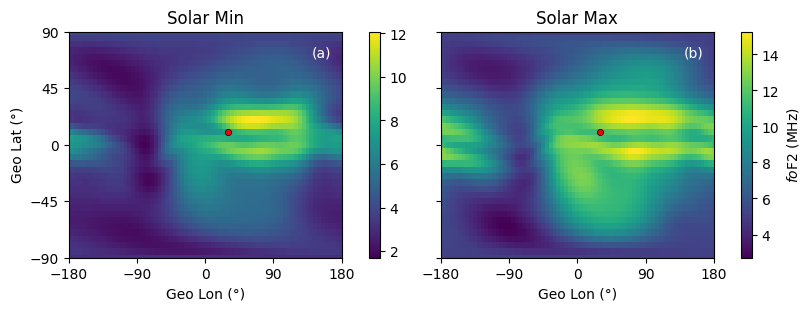
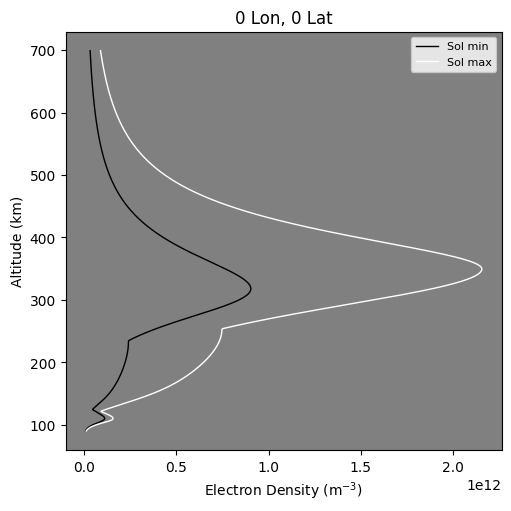
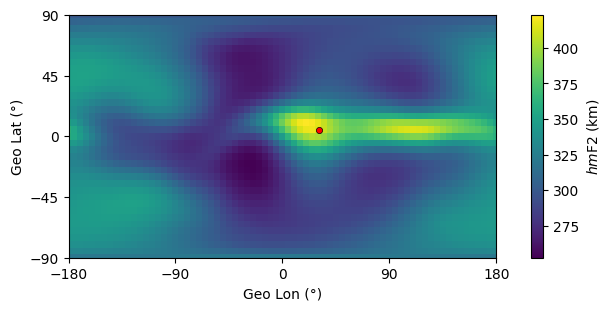
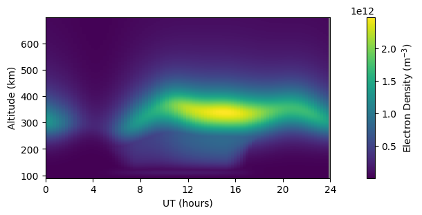

# PyIRI
[](https://pypi.org/project/PyIRI/)
[](https://github.com/victoriyaforsythe/PyIRI/actions/workflows/main.yml)
[](https://pyiri.readthedocs.io/en/latest/?badge=latest)
[](https://doi.org/10.5281/zenodo.8235173)
[](https://coveralls.io/github/victoriyaforsythe/PyIRI?branch=main)

Python implementation of the International Reference Ionosphere (IRI) that
evaluates the electron density and associated ionospheric parameters on the
entire given global grid and for the entire day simultaneously. 

# Installation

PyIRI may be installed from PyPI, which will handle all dependencies.

```
pip install PyIRI
```

You may also clone and install PyIRI from the GitHub repository.

```
git clone https://github.com/victoriyaforsythe/PyIRI.git
cd /path/to/PyIRI
python -m build .
pip install .
```

For more details about the dependencies, see the [examples] and Jupyter
Notebooks [tutorials].

# Example

PyIRI can calculate monthly mean ionospheric parameters
for the user provided grid. The estimation of the parameters
occurs simultaneously at all grid points and for all
desired diurnal time frames.

```
import numpy as np
import PyIRI
import PyIRI.edp_update as ml
import PyIRI.sh_library as sh
import PyIRI.plotting as plot

year = 2020
month = 4

```

Create any horizontal grid (regular or irregular, global or regional).
The grid arrays (alon and alat) should be flattened to be 1-D arrays. 
This is an example of a regular global grid:

```
dlon = 5
dlat = 5
alon_2d, alat_2d = np.mgrid[-180:180 + dlon:dlon, -90:90 + dlat:dlat]
alon = np.reshape(alon_2d, alon_2d.size)
alat = np.reshape(alat_2d, alat_2d.size)

```

Create any temporal array expressed in decimal hours (regular or irregular).
For this example we use regularly spaced time array:
```
hr_res = 1
aUT = np.arange(0, 24, hr_res)
```

Find ionospheric parameters for F2, F1 and E regions by
calling IRI_monthly_mean_par function using PyIRI v0.1.0 with new SH coefficients:

```
hmF2_model = 'SHU2015'   # Also available: 'AMTB2013' and 'BSE1979'
foF2_coeff = 'URSI'      # Also available: 'CCIR'
coord = 'GEO'            # Also available: 'QD' and 'MLT'

f2, f1, e_peak, sun, mag = sh.IRI_monthly_mean_par(
    year, month, aUT, alon, alat,
    coeff_dir=None, foF2_coeff=foF2_coeff, hmF2_model=hmF2_model, coord=coord)
```

Alternatively, one can use the original URSI or CCIR coefficients:

```
ccir_or_ursi = 0     # 0 = CCIR and 1 = URSI

f2, f1, e_peak, es_peak, sun, mag = ml.IRI_monthly_mean_par(
    year, month, aUT, alon, alat,
    PyIRI.coeff_dir, ccir_or_ursi)
```






PyIRI can calculate daily ionospheric parameters for the user provided grid.
The estimation of the parameters occurs simultaneously at all grid points
and for all desired diurnal time frames. The parameters are obtained by
linearly interpolating between min and max levels of solar activity, and
by interpolation between median monthly values to the day of interest.
The user should provide the F10.7 value for the day of interest.

Using a new PyIRI v0.1.0 with spherical harmonic coefficients:

```
# Define F10.7 in SFU
f107 = 100

# Create an array of altitudes in km
aalt = np.arange(90, 1000, 1)

# Define a day of interest
day = 1

(F2, F1, E, sun, mag, EDP) = sh.IRI_density_1day(
    year, month, day, aUT, alon, alat, aalt, F107,
    coeff_dir=None,
    foF2_coeff=foF2_coeff,
    hmF2_model=hmF2_model,
    coord=coord)
```

Alternatively, one can use the original URSI or CCIR coefficients as in PyIRI v0.0.4:

```
f2, f1, e_peak, es_peak, sun, mag, edp = ml.IRI_density_1day(year, month, day, aUT, alon, alat, aalt, f107, PyIRI.coeff_dir, ccir_or_ursi)
```





PyIRI does not calculate the Total Electron Content (TEC) automatically, as
the altitude array is provided by the user. If the user supplies an
array with low resolution, the resulting TEC values may be inaccurate.
The edp_to_vtec function can be used to calculate the vTEC from the edp output.

```
# Find TEC in shape [N_time, N_grid]
TEC = main.edp_to_vtec(edp, aalt, min_alt=0.0, max_alt=202000.0)

```


In case you are interested in a single location (as opposed to the grid)
PyIRI can evaluate parameters at this location if it is passed as a 1-element
NumPy array.

```
alon = np.array([10.])
alat = np.array([20.])

(F2, F1, E, sun, mag, EDP) = sh.IRI_density_1day(
    year, month, day, aUT, alon, alat, aalt, F107,
    coeff_dir=None,
    foF2_coeff=foF2_coeff,
    hmF2_model=hmF2_model,
    coord=coord)
```




For more examples see [tutorials](https://github.com/victoriyaforsythe/PyIRI/tree/main/docs/tutorials)
